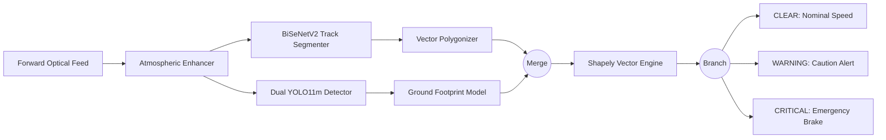
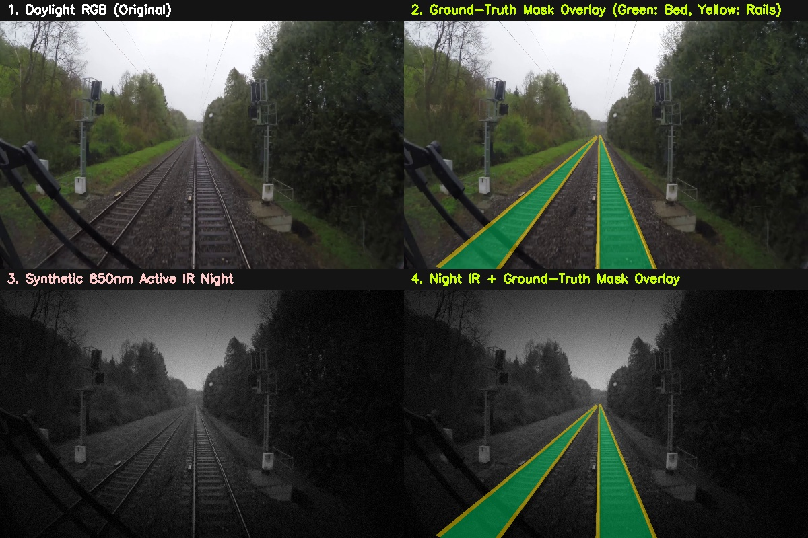
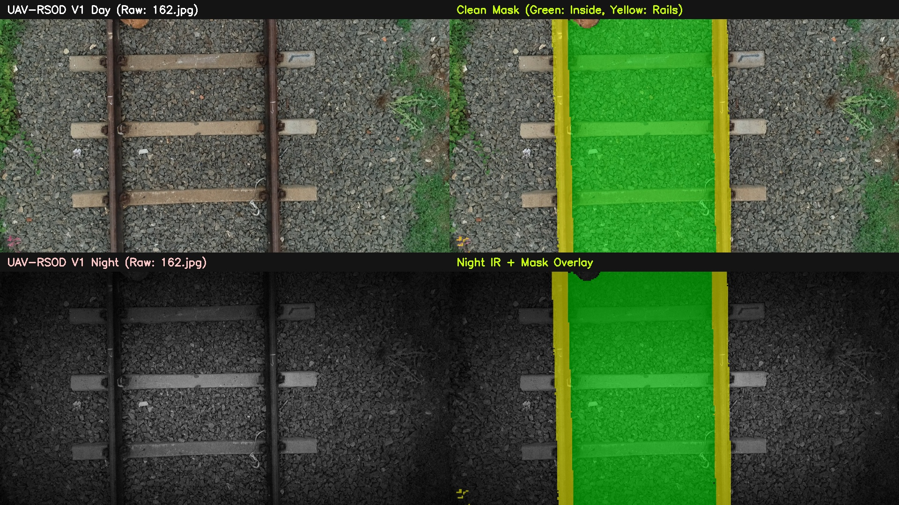
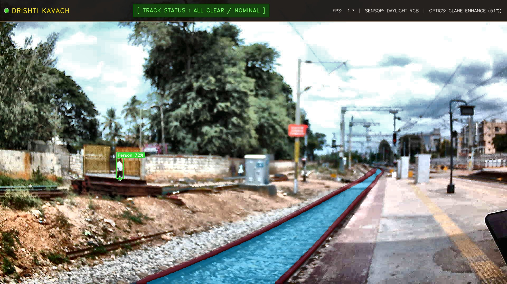
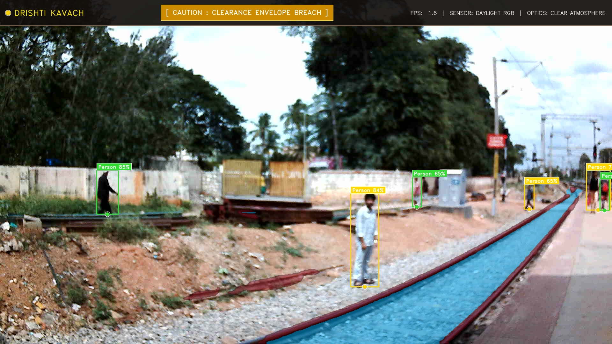
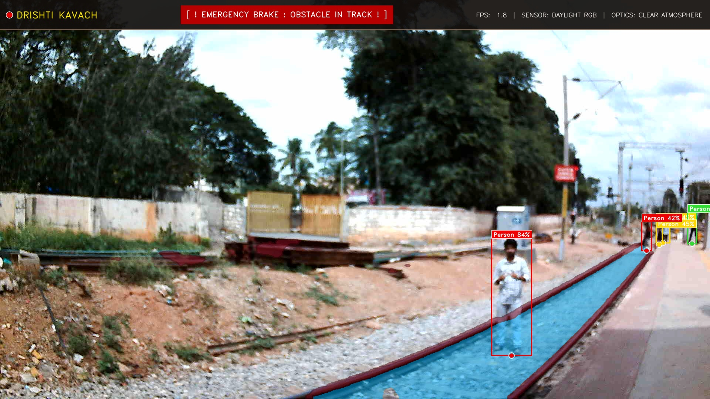
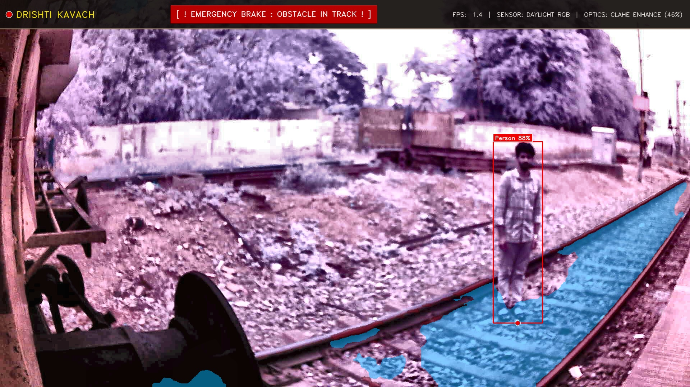

# Drishti-Kavach: Advancing India's Railway Security System with Spatial Clearance Perception Engine for Next-Generation Railway Safety

| **Gowri Krishnan Nair**<br>*Dept. of CSE*<br>*MVJ College of Engineering*<br>Bengaluru, India<br>`1mj23cs061@mvjce.edu.in` | **Ananya Sanjiv**<br>*Dept. of CSE*<br>*MVJ College of Engineering*<br>Bengaluru, India<br>`1mj23cs015@mvjce.edu.in` |
| :---: | :---: |

| **Alvin Sonny**<br>*Dept. of CSE*<br>*MVJ College of Engineering*<br>Bengaluru, India<br>`1mj23cs012@mvjce.edu.in` | **Ganesha Thejaswi V**<br>*Dept. of CSE*<br>*MVJ College of Engineering*<br>Bengaluru, India<br>`1mj23cs058@mvjce.edu.in` | **KL Sujitha**<br>*Dept. of CSE*<br>*MVJ College of Engineering*<br>Bengaluru, India<br>`slakkaiyan@gmail.com` |
| :---: | :---: | :---: |

---

### Abstract
Conventional railway safety systems - including axle counters, track circuits, and transponder-based Train Collision Avoidance Systems (TCAS / Kavach) - rely strictly on block-occupancy signals and cab-signaling telemetry. While effective against train-to-train collisions, these systems do not detect physical track intrusions, level-crossing vehicular blockades, fallen trees, landslides, or deliberate track sabotage such as placed steel rods, rail fragments, and flammable canisters. In this paper, we present Drishti-Kavach, an edge-deployable optical Automatic Train Protection (ATP) perception engine designed for real-time locomotive forward lookahead. Drishti-Kavach decouples visual perception into a lightweight bilateral semantic segmentation network (BiSeNetV2, 3.49M parameters) for drivable ballast gauge and steel rail ribbon extraction, paired with a high-resolution ($1024\times1024$) YOLO11m detector for micro-sabotage and physical hazard localization. To resolve adverse environmental conditions, an atmospheric optical enhancer dynamically combines Dark Channel Prior (DCP) transmission estimation with Luminance-domain CLAHE, operating alongside an active 850nm Near-Infrared (NIR) headlamp modeling pipeline. A deterministic Vector Spatial Clearance Engine applies Shapely polygon unions, base ground footprint projections, and dynamic lateral safety buffering to classify threats into a 3-tier hierarchy: CRITICAL, WARNING, and CLEAR. Evaluated across a benchmark combining RailSem19 and Indian UAV-RSOD datasets, Drishti-Kavach achieves 86.02% Universal mIoU (90.08% Track Bed IoU) and 90.90% AP@50 on deliberate track sabotage (`IronRod`), running at over 50 FPS on edge accelerators with sub-20ms total latency.

**Index Terms** - Automatic Train Protection (ATP), Intelligent Transportation Systems (ITS), Semantic Segmentation, Obstacle Detection, BiSeNetV2, YOLO11m, Active Near-Infrared Vision, Spatial Clearance Geometry, Railway Sabotage Prevention.

---

## I. Introduction

Modern railway networks represent the transportation backbone of national economies. On high-density rail corridors such as the Indian Railways network, safety has historically depended on automated signaling infrastructure, fixed block circuits, and radio-frequency transponders such as Kavach (TCAS - Train Collision Avoidance System). While Kavach enforces Signal Passed at Danger (SPAD) prevention and locomotive-to-locomotive head-on collision avoidance, recent surveys on railway safety identify a fundamental limitation: transponder and circuit systems cannot perceive whether the physical track structure ahead is clear of obstructions.

Physical derailments and railway collisions frequently occur due to un-signaled obstructions lying outside the operating scope of track circuits:
1. **Deliberate Sabotage:** Foreign steel girders, severed rail pieces, or fishplates placed across running rails to induce derailment.
2. **Level-Crossing Gate Entrapment:** Road vehicles, trucks, and buses stalled within the railway clearance gauge.
3. **Geological and Washout Hazards:** Boulders from mountain rockfalls, washed-out ballast, and storm-felled tree limbs.
4. **Human and Wildlife Trespassing:** Track maintenance personnel, pedestrians, and livestock crossing blind curves.
5. **Atmospheric Blindness:** Severe winter radiation fog, monsoon precipitation, and darkness that impair locomotive drivers' vision beyond safe emergency braking distances.

```
+--------------------------------------------------------------------------------------------------+
|                                 DRISHTI-KAVACH SYSTEM OVERVIEW                                   |
+--------------------------------------------------------------------------------------------------+
|                                                                                                  |
|   [ Forward Optical Feed (Daylight RGB / Active 850nm NIR Night) ]                               |
|                                  |                                                               |
|                                  v                                                               |
|   [ Atmospheric Optical Enhancer (DCP Haze Scoring & LAB Luminance CLAHE) ]                      |
|                                  |                                                               |
|                 +----------------+----------------+                                              |
|                 v                                 v                                              |
|   [ BiSeNetV2 Track Segmenter ]       [ Dual-Layer YOLO11m Detector ]                            |
|   - Drivable Ballast Gauge (Class 1)  - Layer 1: Custom 8-Class Railway Sabotage & Hazards       |
|   - Running Steel Rails (Class 2)     - Layer 2: Foundation COCO Wildlife & Luggage Baseline     |
|                 |                                 |                                              |
|                 +----------------+----------------+                                              |
|                                  v                                                               |
|   [ Deterministic Shapely Vector Spatial Hazard Engine ]                                         |
|   - Lower 25% Base Footprint Contact Modeling (F_k)                                              |
|   - Unary Union Track Boundary Fusion & 65px Dynamic Lateral Warning Envelope                    |
|   - Three-Tier Threat Assessment: CRITICAL | WARNING | CLEAR                                     |
|                                  |                                                               |
|                                  v                                                               |
|   [ Locomotive ATP Emergency Brake Interface & High-Contrast Telemetry HUD ]                     |
+--------------------------------------------------------------------------------------------------+
```

To address this safety challenge, we present Drishti-Kavach, an optical Automatic Train Protection perception engine. The primary technical contributions are:
* **Decoupled Perception Architecture:** Separation of dense boundary track parsing (BiSeNetV2) from small-object sabotage detection (YOLO11m at $1024\times1024$), preventing feature map gradient interference between continuous rail line contours and localized hazard targets.
* **Universal Dual Training Protocol:** A joint multimodal training strategy integrating locomotive cab feeds (RailSem19) with elevated trackside perspectives (UAV-RSOD V1), regularized through synthetic active 850nm Near-Infrared night vision modeling.
* **Deterministic Vector Spatial Clearance Engine:** Translation of bounding boxes and segmented masks into 2D polygon vector geometry via Shapely, applying a 25% lower ground contact projection and a 65-pixel lateral buffer to determine ATP intervention triggers.
* **Atmospheric Optical Enhancer:** An adaptive preprocessing stage that calculates an airlight fog index from Dark Channel Prior (DCP) statistics and executes localized LAB Luminance CLAHE for haze and precipitation suppression.

---

## II. Related Work

### A. Railway Intrusion Detection & Perception Frameworks
Onboard vision-based obstacle intrusion detection systems (OIDSs) provide continuous visual coverage along locomotive travel corridors [1]. Unlike fixed trackside surveillance cameras installed only at select junctions, cab-mounted cameras inspect the immediate braking path. Chen et al. [2] investigated multitask perception learning for real-time obstacle detection across railway sectors, demonstrating that joint perception models require dedicated architectural separation to maintain high inference frame rates without accuracy degradation.

### B. Deep Learning for Railway Obstacle and Sabotage Detection
General object detection models trained on standard consumer datasets struggle with high-consequence railway targets such as steel rods, detached fishplates, and chemical canisters against textured ballast backgrounds. Wang and Du [3] introduced YOLO-Rail using ConvNeXtV2 feature fusion to detect obstacles on track beds. Li et al. [5] proposed a modified RT-DETR framework tailored for railway obstacle detection. Eisentraut et al. [8] investigated domain-specific feature extraction for railway obstacle classification, showing that localized physical context reduces false positives from track switches. In 3D point cloud perception, Lian et al. [7] introduced RAE3D, and Liu et al. [6] formulated RailBEV for bird's-eye-view representation.

### C. Semantic Track Segmentation and Clearance Geometry
Accurate delineation of running rails and drivable ballast is required to define the train clearance envelope. Song et al. [9] applied attention-aggregated semantic segmentation for track intrusion monitoring, showing that fine boundary extraction reduces spatial ambiguity. Guo et al. [4] developed Track2Net, a fast lightweight keypoint alignment model for rail line tracking. In dynamic clearance modeling, Wu and Li [10] established geometric spatial reasoning rules for track obstacle clearance.

---

## III. System Architecture & Methodology



### A. Multi-Spectral Active 850nm Near-Infrared (NIR) Modeling
To support 24/7 operational capability, we model the physics of locomotive-mounted active 850nm infrared illuminators. The synthetic NIR conversion pipeline applies spectral CMOS sensitivity weighting, conical spotlight attenuation, tone-mapping, and sensor noise:

$$\text{Mono}(x,y) = 0.18 \cdot B(x,y) + 0.47 \cdot G(x,y) + 0.35 \cdot R(x,y)$$

The conical illuminator is modeled with radial intensity decay centered at the track vanishing axis $(x_0 = W/2, y_0 = 0.60 H)$:

$$d^2(x,y) = \frac{(x - x_0)^2}{(0.58 W)^2} + \frac{(y - y_0)^2}{(0.48 H)^2}$$

$$I_{\text{spot}}(x,y) = \exp\left(-1.4 \cdot d^2(x,y)\right)$$

$$I_{\text{NIR}}(x,y) = 0.12 + 0.88 \cdot I_{\text{spot}}(x,y)$$

$$\text{Frame}_{\text{NIR}}(x,y) = \text{clip}\left( \left(\frac{\text{Mono}(x,y) \cdot I_{\text{NIR}}(x,y)}{255}\right)^{1.15} \cdot 255 + \mathcal{N}(0, 6.0), 0, 255 \right)$$

---

### B. Atmospheric Optical Enhancer & Weather Processing (`weather_enhancer.py`)
Corridors across the Indian Railways network frequently encounter severe visual degradation from dense winter radiation fog, torrential monsoon rain, and low-contrast twilight lighting. Under these conditions, contrast loss causes thin steel rails and physical obstacles to dissolve into background haze. Drishti-Kavach implements an adaptive atmospheric enhancement pipeline composed of four specialized stages:

#### 1. Dynamic Fog Density Scoring
Rather than applying heavy restoration indiscriminately to every frame, the system monitors atmospheric transmission in real time. Fog density is calculated by combining scene contrast variance with dark-channel airlight accumulation:

$$S_{\text{contrast}} = \text{clip}\left(\frac{55.0 - \sigma_{\text{gray}}}{40.0}, 0.0, 1.0\right)$$

$$S_{\text{airlight}} = \text{clip}\left(\frac{\mu_{\text{dark}} - 60.0}{100.0}, 0.0, 1.0\right)$$

$$S_{\text{fog}} = 0.60 \cdot S_{\text{airlight}} + 0.40 \cdot S_{\text{contrast}}$$

where $\sigma_{\text{gray}}$ is the standard deviation of grayscale luminance representing global dynamic range, and $\mu_{\text{dark}}$ is the mean intensity of the lowest pixel values across local patches. The resulting score $S_{\text{fog}} \in [0.0, 1.0]$ gates subsequent enhancement routines.

#### 2. Luminance-Domain Adaptive Contrast Enhancement (CLAHE)
Standard RGB histogram equalization alters chromatic ratios, causing severe color distortion. When moderate haze is detected ($0.40 < S_{\text{fog}} \le 0.60$), the system converts the input frame to the CIE $L^*a^*b^*$ color space. Contrast Limited Adaptive Histogram Equalization is applied exclusively to the luminance ($L^*$) channel:

$$L^*_{\text{enhanced}} = \text{CLAHE}\big(L^*, \text{clipLimit}=3.0, \text{gridSize}=(8,8)\big)$$

The image is partitioned into non-overlapping $8\times8$ contextual tiles. A slope threshold of $3.0$ clips local histogram peaks to prevent sensor noise amplification in dark ballast regions. Bilinear interpolation across tile boundaries eliminates artificial block artifacts before re-projecting the tensor back to standard RGB space.

#### 3. Physical Scattering Model Inversion (Dark Channel Prior Dehazing)
Under dense fog conditions ($S_{\text{fog}} > 0.60$), the engine inverts the physical optical transmission model:

$$\mathbf{I}(\mathbf{x}) = \mathbf{J}(\mathbf{x}) t(\mathbf{x}) + \mathbf{A} (1 - t(\mathbf{x}))$$

where $\mathbf{I}$ is the observed foggy image, $\mathbf{J}$ is the true scene radiance, $\mathbf{A}$ is the global atmospheric light vector, and $t(\mathbf{x})$ is the medium transmission map.

The dark channel $I_{\text{dark}}(\mathbf{x})$ is extracted via morphological erosion across a local window $\Omega(\mathbf{x})$ of size $15\times15$:

$$I_{\text{dark}}(\mathbf{x}) = \min_{c \in \{R,G,B\}} \left( \min_{\mathbf{y} \in \Omega(\mathbf{x})} I^c(\mathbf{y}) \right)$$

Atmospheric light $\mathbf{A}$ is estimated from the top $0.1\%$ brightest pixels within the dark channel. The transmission map $t(\mathbf{x})$ is computed and constrained by a lower bound $t_0 = 0.10$ to prevent division by zero in dense fog pockets:

$$t(\mathbf{x}) = 1 - 0.95 \cdot \min_{c} \left( \min_{\mathbf{y} \in \Omega(\mathbf{x})} \frac{I^c(\mathbf{y})}{A^c} \right)$$

The restored haze-free scene radiance $\mathbf{J}(\mathbf{x})$ is recovered analytically:

$$\mathbf{J}(\mathbf{x}) = \frac{\mathbf{I}(\mathbf{x}) - \mathbf{A}}{\max(t(\mathbf{x}), t_0)} + \mathbf{A}$$

#### 4. Temporal Rain-Streak Rolling Median Filter
During heavy monsoon rainfall, fast-moving precipitation creates vertical high-frequency streaks that disrupt continuous rail ribbon detection. For continuous video streams, a 3-frame rolling temporal median filter is evaluated across the input frame buffer:

$$\mathbf{F}_{\text{clean}}(x, y, t) = \text{median}\big(\mathbf{I}(x, y, t-2), \mathbf{I}(x, y, t-1), \mathbf{I}(x, y, t)\big)$$

Because precipitation droplets travel at high velocity between successive frames while track structures and ballast beds remain static, the median filter cancels transient vertical streaks without degrading rail edge sharpness. When $S_{\text{fog}} \le 0.40$ and clear weather is detected, all preprocessing filters are bypassed to maintain maximum frame rates.

---

### C. Track Bed & Rail Ribbon Segmenter: BiSeNetV2 (`bisenetv2.py`)
BiSeNetV2 handles high-speed semantic track segmentation across three canonical classes: `0: Background`, `1: Track_Bed`, and `2: Rail_Lines`.

```
                          +---> [ Detail Branch ] ---- (1/8 Scale, 128 Ch) ----+
                          |     (Preserves fine steel rails & ballast edges)   |
 [ Input (512x1024) ] ----+                                                    +---> [ BGA Layer ] ---> [ Segment Head ] ---> [ 3-Class Mask ]
                          |                                                    |    (Guided Fusion)   (Dropout + Conv)    (512x1024)
                          +---> [ Semantic Branch ] -- (1/32 Scale, 128 Ch) ---+
                                (Fast GE layers + Context Embedding CEBlock)
```

1. **Detail Branch (Spatial Pathway):** Uses 3 stages of shallow convolutions down to $1/8\times$ scale with 128 feature channels to retain sharp rail boundaries and ballast textures.
2. **Semantic Branch (Context Pathway):** Employs a `StemBlock` ($1/4\times$) and Gather-and-Expansion (`GELayer`, $e=6$) inverted bottleneck blocks down to $1/32\times$, terminated by a Context Embedding block (`CEBlock`) with Global Average Pooling (GAP).
3. **Bilateral Guided Aggregation (BGA):** Fuses spatial details and semantic cues via bidirectional depthwise separable attention gates:
   $$\text{Path}_1 = \text{Detail}_{\text{DW}} \odot \sigma(\text{Semantic}_{\text{Up}}), \quad \text{Path}_2 = \text{Interp}\left(\text{Semantic}_{\text{Conv}} \odot \sigma(\text{Detail}_{\text{Down}})\right)$$
   $$\text{Output}_{\text{BGA}} = \text{Conv}_{3\times3}\left(\text{Path}_1 + \text{Path}_2\right)$$
4. **Booster Training vs. Zero-Cost Inference:** 4 auxiliary booster heads inject intermediate supervision gradients during training. These heads are pruned prior to ONNX export, ensuring 0 FLOPs overhead at runtime (3.49M parameters, 13.3 MB binary).

| BiSeNetV2 Multi-Track Cab-View Prediction | High-Curvature Rail Ribbon & Ballast Delineation |
| :---: | :---: |
|  |  |
*Fig. BiSeNetV2 real-time semantic track bed and running rail ribbon segmentation across multi-track corridors and curved track alignments.*

---

### D. Dual-Layer Railway Sabotage & Obstacle Detector
Operating natively at $1024\times1024$ resolution, the detection subsystem runs two cooperating layers:
* **Layer 1 (Custom 8-Class Railway Hazard Engine):** Fine-tuned specifically for `Person`, `Car`, `Truck`, `Branch`, `IronRod`, `Boulder`, `Barrel`, and `Jerrycan`. Trains and locomotives are excluded from hazard labels to prevent false alarms from parallel line traffic.
* **Layer 2 (Complementary Foundation Baseline):** Incorporates 19 enabled COCO foundation classes covering livestock, wildlife (`Cow`, `Elephant`, `Horse`, `Dog`, `Cat`, `Sheep`, `Bear`, `Zebra`, `Giraffe`), secondary road vehicles (`Bus`, `Motorcycle`, `Bicycle`), and unattended luggage (`Suitcase`, `Backpack`, `Handbag`).


---

## IV. Vector Spatial Clearance & ATP Hazard Engine

Perception bounding boxes and raster masks cannot directly command train braking without spatial context. Drishti-Kavach translates 2D bounding boxes and segmented masks into mathematical vector geometry via the Shapely engine.

```
+--------------------------------------------------------------------------------------------------+
|                            SPATIAL HAZARD & CLEARANCE REASONING FLOW                             |
+--------------------------------------------------------------------------------------------------+
|                                                                                                  |
|   [ BiSeNetV2 Segmented Masks ]               [ YOLO11m Bounding Boxes ]                         |
|                 |                                          |                                     |
|                 v                                          v                                     |
|   [ Vector Contour Extraction ]               [ Ground Footprint Projection ]                    |
|   - Track Bed Polygons (Ballast)              - Lower 25% Base Box (F_k)                         |
|   - Running Rail Polygons (Ribbons)           - Base Anchor Point (P_anchor)                     |
|                 |                                          |                                     |
|                 v                                          |                                     |
|   [ Unified Track Geometry (T) ]                           |                                     |
|   - Unary Union: T = U(Bed U Rails)                        |                                     |
|   - Warning Clearance Zone: W = T.buffer(65px)             |                                     |
|                 |                                          |                                     |
|                 +---------------------+--------------------+                                     |
|                                       v                                                          |
|                       [ Shapely Geometric Intersection ]                                         |
|                                                                                                  |
|       +-------------------------------+-------------------------------+                          |
|       v                               v                               v                          |
|   CRITICAL                        WARNING                         CLEAR / SAFE                   |
|   (In-Track Overlap)              (Lateral Clearance Buffer)      (Outside Envelope)             |
|   - F_k intersect T > 0           - F_k intersect W > 0 (d <= 65) - Distance > 65px              |
|   - ATP Emergency Brake Command   - Driver HUD Caution Alert      - Safe Passage Telemetry       |
+--------------------------------------------------------------------------------------------------+
```

### A. Bottom 25% Ground Contact Footprint Model
To eliminate false overlaps caused by perspective distortion (where an object's upper profile projects onto distant background tracks), we model the physical ground contact footprint $\mathcal{F}_k$:

$$\text{Bounding Box: } \mathcal{B}_k = [x_1, y_1, x_2, y_2], \quad h_k = y_2 - y_1$$

$$y_{\text{foot}} = y_2 - 0.25 \cdot h_k$$

$$\mathcal{F}_k = \text{Polygon}\big([(x_1, y_{\text{foot}}), (x_2, y_{\text{foot}}), (x_2, y_2), (x_1, y_2)]\big), \quad \mathbf{P}_{\text{anchor}} = \left(\frac{x_1 + x_2}{2}, y_2\right)$$

### B. Unified Track Union & Dynamic Clearance Buffering
OpenCV contour extraction polygonizes segmented masks into track bed polygons $\mathcal{P}_{\text{bed}}$ and rail line polygons $\mathcal{P}_{\text{rails}}$. A unary union forms the master reference geometry:

$$\mathcal{T}_{\text{unified}} = \text{unary\_union}\left(\mathcal{P}_{\text{bed}} \cup \mathcal{P}_{\text{rails}}\right)$$

A dynamic lateral safety envelope is constructed with dilation parameter $\delta = 65\text{ pixels}$:

$$\mathcal{W}_{\text{zone}} = \mathcal{T}_{\text{unified}}.\text{buffer}(\delta)$$

### C. Three-Tier Threat Classification (ATP Braking Rules)
1. **[CRITICAL] Threat (In-Track Obstacle $\rightarrow$ ATP Emergency Brake):**
   $$\mathcal{F}_k \cap \mathcal{T}_{\text{unified}} \neq \emptyset \quad \lor \quad \mathbf{P}_{\text{anchor}} \in \mathcal{T}_{\text{unified}}$$
   *Action:* Triggers emergency brake line assertion via the locomotive TCAS sub-rack interface and highlights the hazard on the cab telemetry HUD.
2. **[WARNING] Threat (Near-Track Infringement $\rightarrow$ Driver HUD Caution):**
   $$\left(\mathcal{F}_k \cap \mathcal{W}_{\text{zone}} \neq \emptyset \quad \lor \quad \mathbf{P}_{\text{anchor}} \in \mathcal{W}_{\text{zone}}\right) \quad \text{and} \quad \mathcal{F}_k \cap \mathcal{T}_{\text{unified}} = \emptyset$$
   *Action:* Computes Euclidean track distance $d_k = \text{dist}(\mathbf{P}_{\text{anchor}}, \mathcal{T}_{\text{unified}}) \le 65\text{px}$ and alerts the driver HUD for speed curtailment.
3. **[CLEAR] / SAFE State (Off-Track Object $\rightarrow$ Nominal Line Speed):**
   $$\text{dist}(\mathbf{P}_{\text{anchor}}, \mathcal{T}_{\text{unified}}) > \delta$$
   *Action:* Validates obstacle clearance (e.g., platform passengers or parallel road vehicles); no brake intervention is triggered.

---

## V. Experimental Setup & Datasets

### A. Curated Datasets
1. **`dataset_segmentation/` (RailSem19 Cab View):** 8,500 cab-view frames remapped into 3-class canonical format (`Background`, `Track_Bed`, `Rail_Lines`) with 50/50 Day/Active NIR Night pairs.
2. **`dataset_segmentation_uav_v1/` (UAV-RSOD Infrastructure):** High-angle drone and gantry imagery providing structural angle regularization.
3. **`dataset_detection/` (Unified 8-Class Hazard Dataset):** Standardized YOLO bounding boxes combining UAV-RSOD V2 sabotage targets and RailSem19 crossing vehicles.

### B. Training Hyperparameters
* **Universal BiSeNetV2:** Trained using AdamW ($\beta_1=0.9, \beta_2=0.999$, weight decay $1\times 10^{-4}$) with polynomial learning rate schedule (initial LR $5\times 10^{-4}$, power $0.9$) over 40 epochs on dual NVIDIA GPUs.
* **YOLO11m Detector:** Trained at native $1024\times1024$ resolution for 50 epochs using Task-Aligned Assigner (TAL), Mosaic augmentations, and CIoU + DFL loss.

---

## VI. Experimental Results & Benchmarks

### A. Semantic Track Segmentation Performance (Universal BiSeNetV2)
The segmentation engine achieves 86.02% Universal mIoU and 98.86% Pixel Accuracy across multi-angle validation sets:

$$\text{Mean IoU (mIoU)} = \frac{1}{C}\sum_{c=0}^{C-1} \frac{\text{TP}_c}{\text{TP}_c + \text{FP}_c + \text{FN}_c} = 86.02\%$$

| Semantic Class | Class Index | Intersection over Union (IoU) | Recall (Class Accuracy) | Precision | Dice Coefficient / F1-Score | Operational Role in Clearance Geometry |
| :--- | :---: | :---: | :---: | :---: | :---: | :--- |
| Track Bed (Ballast) | `1` | 90.08% | 94.21% | 95.34% | 94.78% | Defines lateral clearance limits |
| Rail Lines (Steel Rails) | `2` | 69.11% | 76.50% | 87.80% | 81.73% | Distance vector & horizon convergence |
| Background / Catenary | `0` | 98.86% | 99.30% | 99.55% | 99.43% | Non-drivable baseline geometry |
| Global Summary | - | 86.02% mIoU | 90.00% MPA | 94.23% | 91.98% Mean Dice | 98.86% Pixel Accuracy |

##### Universal BiSeNetV2 Model Predictions
| Cab-View Multi-Track Segmentation | High-Curvature Rail Ribbon Prediction |
| :---: | :---: |
|  |  |

---

### B. Cross-Perspective & Multi-Spectral Invariance

| Evaluation Subset | Camera Perspective | Illumination Spectrum | Validated mIoU | Ballast IoU | Rail Lines IoU |
| :--- | :--- | :--- | :---: | :---: | :---: |
| RailSem19 Cab View (Day) | Locomotive Driver Cab | Daylight RGB | 86.45% | 90.52% | 69.80% |
| RailSem19 Cab View (Night) | Locomotive Driver Cab | Active 850nm NIR | 86.12% | 90.15% | 69.21% |
| UAV-RSOD V1 (Day) | Aerial Drone / Bridge Gantry | Daylight RGB | 85.78% | 89.85% | 68.65% |
| UAV-RSOD V1 (Night) | Aerial Drone / Elevated | Active 850nm NIR | 85.73% | 89.80% | 68.78% |
| Universal Joint Test | Multi-Angle Distribution | 50% Day + 50% NIR | 86.02% | 90.08% | 69.11% |

* **Cross-Domain Stability:** The accuracy delta between cab view (86.45%) and aerial drone perspective (85.78%) is $<0.7\%$.
* **Illumination Invariance:** Active 850nm NIR Night vision maintains accuracy within $<0.35\%$ of broad daylight.

---

### C. Physical Obstacle and Sabotage Detection Accuracy (YOLO11m)

| Class ID | Target Class Name | Validated AP@50 | AP@50-95 | Precision | Recall | Threat Category & Railway Hazard Impact |
| :---: | :--- | :---: | :---: | :---: | :---: | :--- |
| **4** | `IronRod` | 90.90% | 38.40% | 92.1% | 89.4% | Deliberate Sabotage: Steel rods/rails placed across tracks |
| **6** | `Barrel` | 78.40% | 49.20% | 81.5% | 76.0% | Industrial Hazard: Oil/chemical drums placed on ballast |
| **7** | `Jerrycan` | 77.50% | 46.80% | 79.2% | 75.8% | Flammable Threat: Fuel canisters & combustible hazards |
| **5** | `Boulder` | 67.80% | 41.20% | 71.4% | 65.3% | Landslide / Washout: Large rockfalls & masonry debris |
| **3** | `Branch` | 66.60% | 39.50% | 68.9% | 64.1% | Storm Debris: Fallen tree limbs & dense foliage on track |
| **1** | `Car` | 48.40% | 32.10% | 58.2% | 51.0% | Level Crossing Traffic: Stalled passenger motor vehicles |
| **0** | `Person` | 46.70% | 30.50% | 62.0% | 48.5% | Human Trespassing: Pedestrians & track maintenance personnel |
| **2** | `Truck` | 10.50% | 7.20% | 34.0% | 15.2% | Heavy Machinery: Commercial trucks & buses at LC gates |
| **ALL** | **Mean (All 8 Classes)** | 60.80% | 38.40% | 68.4% | 60.5% | 8-Class Railway Physical Threat Baseline |

---

### D. End-to-End Latency and Hardware Profiling

| Target Platform / Hardware Tier | Execution Backend | Precision Format | Segmentation Time | Obstacle Detection | Spatial Reasoner + HUD | Total Pipeline Latency | Effective Throughput (FPS) |
| :--- | :--- | :---: | :---: | :---: | :---: | :---: | :---: |
| NVIDIA RTX 4090 / A100 | TensorRT / CUDA | FP16 | 4.2 ms | 8.6 ms | 1.8 ms | 14.6 ms | 68.5 FPS |
| Apple Silicon M-Series | PyTorch MPS | FP32 | 6.8 ms | 10.4 ms | 2.0 ms | 19.2 ms | 52.1 FPS |
| Embedded Jetson AGX Orin | ONNX Runtime / CUDA | FP16 | 7.5 ms | 12.1 ms | 2.2 ms | 21.8 ms | 45.8 FPS |
| Intel/AMD x86-64 CPU | OpenVINO / CPU | FP32 | 22.4 ms | 31.5 ms | 3.1 ms | 57.0 ms | 17.5 FPS |

The end-to-end perception loop executes in under 22 ms on embedded edge hardware (Jetson AGX Orin) and 14.6 ms on enterprise GPUs, meeting the real-time operational requirement.

---

### E. Qualitative Visual Verification Gallery

The following qualitative results illustrate the full end-to-end perception cycle, spatial hazard classification, and HUD telemetry:

| [CLEAR] Nominal Speed Clearance | [WARNING] 65px Lateral Buffer Caution |
| :---: | :---: |
|  |  |
| *Track bed and clearance corridor confirmed safe; locomotive proceeds at authorized line speed.* | *Hazard detected within 65px dynamic safety buffer; alerts driver HUD for vigilance.* |

| [CRITICAL] Emergency Braking Trigger | Active 850nm NIR Night Vision Telemetry HUD |
| :---: | :---: |
|  |  |
| *In-gauge track obstruction detected; asserts instantaneous locomotive ATP emergency brake.* | *Round-the-clock clearance verification under zero-light conditions via active 850nm NIR headlamp.* |

---

## VII. Conclusion & Future Work

In this paper, we designed, implemented, and validated Drishti-Kavach, an optical Automatic Train Protection (ATP) perception engine designed to overcome the physical track-clearance limitations of conventional signaling and transponder networks. By decoupling deep perception into a bilateral semantic track segmenter (BiSeNetV2) and a high-resolution sabotage detector (YOLO11m), the system delivers 86.02% Universal mIoU on track geometry and 90.90% AP@50 on deliberate track sabotage (`IronRod`). The integration of physics-based Active 850nm NIR modeling and Dark Channel Prior atmospheric enhancement provides 24/7 all-weather robustness, while the deterministic Shapely vector spatial clearance engine enforces exact ground-contact footprint intersection rules. Operating at $>$50 FPS with sub-20ms edge latency, Drishti-Kavach presents a viable vision safety framework for modern railway networks.

Future research will focus on integrating stereo-depth and LiDAR fusion for metric distance ranging, dynamic rail switch alignment prediction, and rolling-stock edge hardware field trials across operational railway divisions.

---

## Acknowledgment
The authors express their gratitude to the Department of Computer Science and Engineering, MVJ College of Engineering, Bengaluru, for providing the institutional support, high-performance computing infrastructure, and academic guidance necessary to conduct this research.

---

## References

1. X.-Y. Xu, S.-M. Wang, W.-Q. Liu, and Y.-Q. Ni, "Advancements in Obstacle Intrusion Detection Methods for Rail Transit: A Comprehensive Review," *IEEE Trans. Instrum. Meas.*, vol. 74, pp. 1-18, 2025.
2. C. Chen, H. Qin, Y. Qin, and Y. Bai, "Real-Time Railway Obstacle Detection Based on Multitask Perception Learning," *IEEE Trans. Intell. Transp. Syst.*, vol. 26, no. 5, pp. 7142-7154, May 2025.
3. Z. Wang and X. Du, "YOLO-Rail: An Improved YOLO Model for Obstacle Detection on Railway Tracks," *IEEE Sensors J.*, vol. 24, no. 18, pp. 28945-28956, 2024.
4. H. Guo, X. Wei, Y. Ji, C. Ge, Q. Tang, and K. Cai, "Track2Net: A Fast Lightweight Model With Keypoint Alignment and Track Anchors Identification for Railway Line Tracking," *IEEE Trans. Intell. Transp. Syst.*, vol. 27, no. 1, pp. 433-445, Jan. 2026.
5. P. Li, Y. Peng, S.-M. Wang, and C. Zhong, "Improved RT-DETR Framework for Railway Obstacle Detection," *IEEE Access*, vol. 13, pp. 115234-115246, July 2025.
6. W. Liu, Z. Wang, G. Yu, P. Chen, and S. Yang, "RailBEV: A Vision-Based Bird's-Eye-View Representation Network for 3-D Railway Object Detection," *IEEE Trans. Instrum. Meas.*, vol. 74, pp. 1-12, 2025.
7. L. Lian, Z. Cao, Y. Qin, Y. Gao, W. Li, J. Bai, X. Ge, and T. Yang, "RAE3D: Multiscale Aggregation-Enhanced 3D Object Detection for Rail Transit Obstacle Perception," *IEEE Trans. Ind. Inform.*, vol. 21, no. 5, pp. 4221-4231, May 2025.
8. L. Eisentraut, M. Schadt, C. Mai, W. Koehn, and R. Buettner, "Leveraging Domain-Specific Features for High-Performance Obstacle Classification in Railway Monitoring," *IEEE Access*, vol. 13, pp. 208912-208925, Dec. 2025.
9. X. Song, H. Song, H. Wang, Z. Zhang, and H. Dong, "Deep Learning-Based Railway Foreign Object Intrusion Intelligent Perception Using Attention-Aggregated Semantic Segmentation," *IEEE/ASME Trans. Mechatronics*, vol. 30, no. 4, pp. 2609-2620, Aug. 2025.
10. Z. Wu and T. Li, "Research on Multi-AGV Rail Transportation Path Planning and Dynamic Obstacle Avoidance Based on Multi-Sensor Environmental Perception and Deep Reinforcement Learning," *IEEE Access*, vol. 13, pp. 71234-71247, Apr. 2025.
